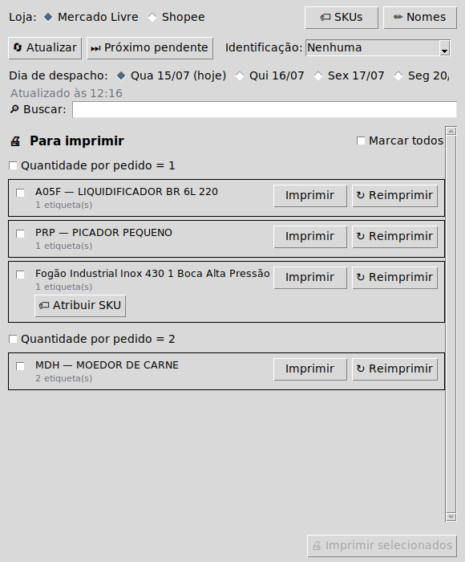
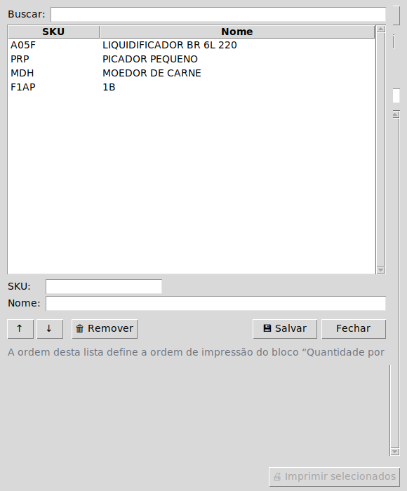
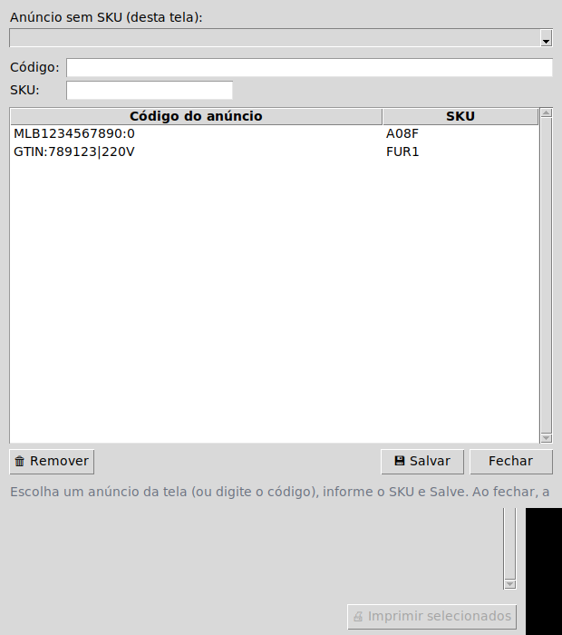
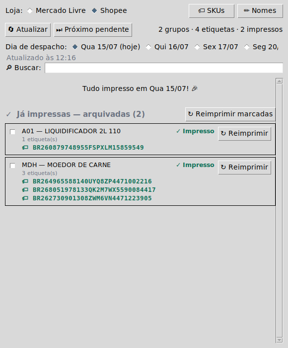

<div align="center">

# Contador — Separador de Etiquetas

**Separa e imprime etiquetas de envio do Mercado Livre e da Shopee em impressora térmica Zebra (ZPL), em lote, agrupadas por produto e sem erro de separação.**

[](https://github.com/joaobz14/contador/actions/workflows/testes.yml)




</div>

---

## Visão geral

O **Contador** é uma ferramenta de mesa (Windows) para quem despacha muitos pedidos
por dia no **Mercado Livre** e na **Shopee**. Ele resolve a etapa de separação e
impressão: lê os pedidos prontos para envio, **agrupa por produto + quantidade**,
gera o **ZPL** e entrega um arquivo `.zip` na pasta **Downloads**, que um aplicativo
externo da Zebra reconhece e envia à impressora.

O ganho principal é a **separação por produto**: em vez de imprimir pedido a pedido,
o operador vê uma **pilha de etiquetas por produto/quantidade**, na **sua ordem
pessoal de separação** — o que reduz erro e retrabalho no empacotamento.

```text
pedidos prontos → agrupamento (produto × qtd) → ZPL → .zip em Downloads → impressão na Zebra
                                          ↑ confirmação física antes de marcar "impresso"
```

---

## Índice

- [Principais recursos](#principais-recursos)
- [Como funciona no dia a dia](#como-funciona-no-dia-a-dia)
- [Separação por produto e ordem pessoal](#separação-por-produto-e-ordem-pessoal)
- [Anúncios sem SKU](#anúncios-sem-sku)
- [Shopee](#shopee)
- [Requisitos](#requisitos)
- [Instalação](#instalação)
- [Configuração](#configuração)
- [Dois PCs (escritório e casa)](#dois-pcs-escritório-e-casa)
- [Bot do Telegram](#bot-do-telegram-opcional)
- [Linha de comando](#linha-de-comando)
- [Funcionamento interno](#funcionamento-interno)
- [Segurança e credenciais](#segurança-e-credenciais)
- [Testes](#testes)
- [Estrutura do projeto](#estrutura-do-projeto)
- [Limitações conhecidas](#limitações-conhecidas)

---

## Principais recursos

### Marketplaces
- **Mercado Livre** e **Shopee** na mesma tela (a lógica de cada um fica atrás de
  uma abstração de **provedor**).
- **Multi-conta no Mercado Livre**, cada conta com credenciais e estado isolados.
- **Modo "🌐 Ambas"** (Mercado Livre): junta as contas no mesmo dia de motorista,
  fundindo os grupos por SKU + quantidade — uma pilha por produto, num ZIP único,
  cada etiqueta impressa com o token da sua conta.

### Separação e identificação
- **Agrupamento por produto + quantidade**, com blocos separados por quantidade.
- **Ordem de separação pessoal**: a ordem da aba **Nomes** define a sequência dos
  produtos no bloco "Quantidade por pedido = 1" (ajustável com as setas ↑/↓).
- **Nomes amigáveis** (SKU → nome) editáveis pela própria tela.
- **Adoção de anúncios sem SKU**: anúncios antigos sem SKU podem ser **adotados**
  num SKU do sistema, passando a agrupar/ordenar/carimbar como os demais.
- **Carimbo na DANFE** (Mercado Livre) com o **SKU** ou o **nome do produto** —
  acentos corretos (UTF-8), fonte adaptativa e a quantidade em destaque (`2x`,
  `3x`…) em pedidos com 2+ unidades. Alternativas: **divisória** ou **nenhuma**.
- **Conferência na Shopee**: como a etiqueta Shopee não tem o nome do produto, a
  tela lista o **código de rastreio (AWB) de cada etiqueta** do grupo.

### Impressão e operação
- **Impressão em lote** (um único `.zip`, sem intervalo entre etiquetas).
- **Confirmação física** antes de marcar como impresso.
- **Reimpressão** individual ou em lote (não altera o "já impresso").
- **Marcar todos** (geral e por bloco), **busca** por nome/SKU, seletor de **dia de
  despacho** com a contagem de pedidos por dia.
- **Atalhos**: `F5` (atualizar), `Ctrl+F` (buscar), `Esc` (limpar busca).

### Confiabilidade e segurança
- Estado de "já impresso" **por marketplace, conta e dia de despacho**.
- Gravação de arquivos **atômica e durável** (`.tmp` + `fsync` → `replace`), com
  **backup `.bak`** das credenciais e auto-recuperação.
- **Credenciais e dados locais nunca vão para o Git.**
- **Log operacional** (`separador.log`) com **redação de segredos**.

### Automação
- **Bot do Telegram** opcional: consulta de qualquer lugar e — no Mercado Livre —
  impressão remota.

---

## Como funciona no dia a dia

1. Abra a tela com **`Abrir Separador.bat`** (duplo-clique).
   - Se não abrir, use **`atalhos\Abrir Separador (diagnostico).bat`** (mantém o
     terminal aberto mostrando o erro).
2. Escolha a **loja**, a **conta** (no Mercado Livre) e o **dia de despacho**.
3. Clique em **Atualizar** — cada dia do seletor mostra quantos pedidos tem.
4. **Marque os grupos** (ou *Marcar todos*).
5. Clique em **Imprimir selecionados** — todas as etiquetas saem num único `.zip`.
6. **Confirme fisicamente**: o app pergunta se as etiquetas saíram corretamente;
   só depois do seu **sim** os grupos são marcados como impressos.

> **Regra de ouro:** o app **nunca marca como impresso antes da sua confirmação**.
> Se a impressora falhar, o pedido continua na lista para reimprimir — nada some.

---

## Separação por produto e ordem pessoal

A lista mostra os grupos em **blocos por quantidade** ("Quantidade por pedido = 1",
"= 2"…). **Dentro do bloco de quantidade 1**, os produtos seguem a **ordem da aba
Nomes** — a sua ordem de separação física. Ajuste-a com as setas **↑/↓** no editor,
sem editar arquivo nenhum:

<div align="center">

</div>

- O botão **✏ Nomes** abre o editor `SKU → nome` (buscar, salvar, remover, reordenar).
- A **ordem das chaves é preservada** e é significativa: é a ordem de impressão do
  bloco "qtd 1". SKU sem nome cadastrado vai para o fim, em ordem natural
  (`A2` antes de `A10`).
- É só **exibição/ordem**: o agrupamento e o controle de impresso seguem pelo SKU.
  O `nomes_sku.json` é **versionado** e sincroniza entre os PCs via Git.

---

## Anúncios sem SKU

Anúncios antigos do Mercado Livre **sem `seller_sku`** apareciam pelo **título** e
carimbavam o **código do anúncio** (ex.: `MLB3982067005:0`), ficando fora do seu
sistema de SKUs. Agora eles podem ser **adotados** num SKU:

- No próprio grupo sem SKU, o botão **🏷 Atribuir SKU** pede o SKU do sistema
  (ex.: `F1AP`). Ao confirmar, o app **agrupa na hora** (sem precisar Atualizar):
  o anúncio passa a **agrupar/ordenar/carimbar/nomear igual** àquele SKU.
- O botão **🏷 SKUs** abre um **gerenciador** para adotar os anúncios da tela (por
  uma lista) e **editar/remover** os mapeamentos salvos.

<div align="center">

</div>

O de-para fica em **`skus_por_anuncio.json`** (versionado, sincroniza via Git). O
carimbo final (ex.: "1B") vem do **nome do SKU** na aba Nomes — então o caminho é
`MLB… → F1AP` (aqui) + `F1AP → "1B"` (na aba Nomes).

---

## Shopee

A etiqueta da Shopee é uma **imagem pronta, sem o nome do produto**. Por isso, para
separar o lote, a tela lista o **código de rastreio (AWB) de cada etiqueta** já
impressa do grupo — o operador cruza o código da etiqueta física com o produto. Em
grupos de alto volume, a área cresce em altura sem espremer:

<div align="center">

</div>

**Fluxo Shopee** (a etiqueta só existe **após organizar o envio**, que emite o AWB):

1. Listar pedidos prontos e agrupar por SKU + quantidade.
2. **Organizar o envio** como **Postagem (drop-off)** → a Shopee emite o **AWB**.
3. **Criar o documento térmico**, que **exige o AWB** no corpo da requisição.
4. Aguardar o status **`READY`** e **baixar** a etiqueta.
5. Salvar o `.zip` na pasta Downloads (o ZPL que a Zebra imprime direto).

> Antes de imprimir, o app pergunta se pode **organizar o envio**. Só depois disso a
> etiqueta (e o rastreio) existe. Pendentes ainda não têm código.

---

## Requisitos

| Requisito | Detalhe |
|---|---|
| Sistema | **Windows** |
| Python | **3.11 ou superior** |
| Git | Para clonar e atualizar o projeto |
| Impressora | **Zebra** compatível com **ZPL** |
| Dependências | Listadas em `requirements.txt` |
| Mercado Livre | Aplicação criada no DevCenter (App ID e Client Secret) |
| Shopee | App **Live** em [open.shopee.com](https://open.shopee.com), Redirect URL `https://joaobz14.github.io/contador/` |
| App da Zebra | `impressora_zebra_usb.py` — **externo a este repositório**; monitora a pasta Downloads e envia os `.zip` à impressora |

---

## Instalação

```bash
git clone https://github.com/joaobz14/contador.git
cd contador
python -m venv .venv
.venv\Scripts\activate
pip install -r requirements.txt
```

---

## Configuração

### Mercado Livre (uma vez por conta)

```bash
python pegar_token.py
```

Pede o **nome da conta** e salva as credenciais em `contas/{nome}/credenciais.json`.
**Repita para cada conta.** Atalho: `atalhos\Pegar Token.bat`.

### Shopee (uma vez)

```bash
python pegar_token_shopee.py
```

**Pré-requisito:** app da Shopee **Live** em [open.shopee.com](https://open.shopee.com),
com a Redirect URL `https://joaobz14.github.io/contador/` cadastrada (página servida
pela pasta `docs/` via GitHub Pages). Atalho: `atalhos\Pegar Token Shopee.bat`.

### Credenciais

- **Nunca são versionadas** (já constam no `.gitignore`).
- **Modelos** dos arquivos de configuração em [`exemplos/`](exemplos/) (`*.example.json`).

---

## Dois PCs (escritório e casa)

- Cada PC usa o **seu próprio clone**; atualize com **`Atualizar programa.bat`**
  (`git pull`) em cada máquina.
- **Sincronizam via Git:** `nomes_sku.json` (nomes + ordem) e `skus_por_anuncio.json`
  (adoção de anúncios sem SKU).
- **Ficam locais** de cada máquina: credenciais, estado de impresso, caches e logs.

---

## Bot do Telegram (opcional)

Consulta os pedidos pelo celular e, no **Mercado Livre**, dispara a impressão remota.

```bash
pip install -r requirements-bot.txt
copy exemplos\bot_config.example.json bot_config.json
python bot_telegram.py
```

Preencha o `bot_config.json` com o **token** do bot (obtido no `@BotFather`).

| Comando | Função |
|---|---|
| `/hoje` `/amanha` `/dia <AAAA-MM-DD>` `/todos` | Lista os grupos por dia de despacho |
| `/resumo` | Quantidade de pacotes por dia |
| `/detalhar <SKU>` | Composição de um SKU |
| `/conta` | Vê/troca a conta ativa (com 2+ contas) |
| `/loja` | Alterna entre Mercado Livre e Shopee |
| `/id` | Mostra o seu chat id |
| `/menu` | Abre o menu de botões |

- **Impressão pelo bot é apenas Mercado Livre** (na Shopee é só consulta).
- A impressão sai **na máquina onde o bot roda** (o `.zip` cai no Downloads dela) —
  rode o bot no PC do escritório, com a Zebra ligada.
- **Segurança:** responde só aos `chat_ids` autorizados; token do `bot_config.json`
  (não versionado) ou da variável `TELEGRAM_BOT_TOKEN`. Envie `/id` para descobrir o seu.
- **Aviso da manhã:** `"aviso_horario": "08:00"` no `bot_config.json` (fuso de Brasília).
- **Iniciar:** `atalhos\Iniciar Bot.bat` ou `atalhos\Iniciar Bot (auto).bat`
  (reinicia sozinho se cair — recomendado). Atividade/erros em `bot.log`.

---

## Linha de comando

Alternativa à interface gráfica, útil para diagnóstico e automação.

**Mercado Livre**
```bash
python separador_etiquetas_ml.py                            # grupos prontos de HOJE
python separador_etiquetas_ml.py todos                      # todos os dias
python separador_etiquetas_ml.py envios                     # datas de despacho de cada envio
python separador_etiquetas_ml.py resumo                     # pacotes por dia
python separador_etiquetas_ml.py detalhar "<nome>" <QTD>    # composição de um grupo
python separador_etiquetas_ml.py imprimir "<nome>" <QTD>    # imprime um grupo
python separador_etiquetas_ml.py reimprimir "<nome>" <QTD>  # reimprime (não altera o estado)
python separador_etiquetas_ml.py proximo                    # imprime o próximo pendente
python separador_etiquetas_ml.py rastrear <SKU>             # diagnóstico de um SKU
```

**Shopee**
```bash
python shopee_api.py                                        # grupos prontos de HOJE
python shopee_api.py amanha | todos | dia <AAAA-MM-DD>      # outros dias
python shopee_api.py etiqueta <order_sn>                    # gera/baixa a etiqueta (Downloads)
python shopee_api.py parametros <order_sn>                  # diagnóstico dos tipos de documento
```

> Atalho: `atalhos\Etiqueta Shopee.bat` lista os pedidos de hoje, pergunta o
> `<order_sn>` e gera a etiqueta.

---

## Funcionamento interno

### Agrupamento e identidade
A identidade de cada produto segue a prioridade **SKU → GTIN + voltagem →
`item_id:variação`**, com o de-para `skus_por_anuncio.json` **adotando** anúncios sem
SKU num SKU do sistema. O agrupamento é **por envio = 1 etiqueta**: um pedido com
vários SKUs (kit/combo) vira um único grupo "Combo", listando os itens.

### Identificação na impressão (Mercado Livre)
Aplicada **apenas na DANFE** (a etiqueta de envio fica intacta):

| Modo | O que é impresso na DANFE |
|---|---|
| **Carimbo SKU** | O código do produto, centralizado na área livre |
| **Carimbo nome** | O nome cadastrado (fonte adaptativa, acentos UTF-8; sem nome, cai no SKU). Pedidos com 2+ unidades ganham `2x`, `3x`… em destaque |
| **Divisória** | Uma página separadora antes de cada lote |
| **Nenhuma** | Sem identificação |

### Estado de "já impresso"
Registrado **por marketplace, conta e dia de despacho** — ML em
`contas/{conta}/estado_grupos.json`, Shopee em `estado_shopee.json`. Marcado só
**após a confirmação física**; reimpressão **não altera** esse estado. A gravação
recarrega e **mescla** com o disco (a tela e o bot na mesma conta não apagam a
marcação um do outro).

### Impressão / ponte com a Zebra
O ZPL vira um `.zip` na pasta **Downloads**, com um **prefixo** que o app externo da
Zebra reconhece (`etiqueta de envio` p/ ML, `etiqueta shopee` p/ Shopee). Esse app
monitora a pasta e envia à impressora.

### Arquivos gerados (não versionados)
`credenciais.json` (+ `.bak`), `credenciais_shopee.json`, `estado_grupos.json`,
`estado_shopee.json`, `itens_cache.json`, `envios_cache.json`, `config.json`,
`bot_config.json`, `bot.log`, `separador.log`, `shopee_tempos.log` e
`link_autorizacao*.txt`.

---

## Segurança e credenciais

- **Nunca commitados:** credenciais do ML e da Shopee, tokens, config do bot, estado
  e caches (todos no `.gitignore`).
- **Locais de cada máquina:** credenciais, estado, caches, `config.json`,
  `bot_config.json` e logs.
- **Token via `obter_token`**, com lock: o `refresh_token` **rotaciona**, então o app
  evita corridas de renovação (inclusive entre a tela e o bot na mesma conta).
- **Logs nunca gravam segredos:** todo texto de erro passa por uma redação antes de
  ir ao `separador.log`/tela/bot (a URL assinada da Shopee leva o token na query).
- **Backups `.bak`** das credenciais, com auto-recuperação (também não versionados).

---

## Testes

```bash
pip install -r requirements-dev.txt
pytest
```

A suíte roda **sem rede** e sem arquivos reais.

Para inspecionar a interface **sem monitor** (headless):

```bash
bash tools/setup_gui_tests.sh                             # 1x: tkinter + xvfb + imagemagick
xvfb-run -a python3.12 tools/gui_screenshot.py out.png    # modo Mercado Livre
xvfb-run -a python3.12 tools/gui_screenshot.py shopee.png Shopee
```

O CI (`.github/workflows/testes.yml`) roda o `pytest` (Python 3.11 e 3.12) e o job
**`gui-smoke`**, que abre a tela headless nos dois marketplaces e publica os
screenshots como artefato.

---

## Estrutura do projeto

| Caminho | Função |
|---|---|
| `separador_etiquetas_ml.py` | Núcleo: API do Mercado Livre, agrupamento, ZPL, carimbo e CLI |
| `estado.py` | Camada comum do estado "já impresso" (ML + Shopee) e IO de JSON atômico |
| `registro.py` | Log operacional (`separador.log`) com redação de segredos |
| `shopee_api.py` | Integração Shopee (API v2): listar, organizar envio, etiqueta e estado |
| `provedores.py` | Abstração de marketplace usada pela interface (ML, Shopee e modo Ambas) |
| `separador_gui.py` | Interface gráfica (Tkinter) |
| `bot_telegram.py` / `relatorio.py` | Bot do Telegram e formatação dos textos |
| `pegar_token.py` / `pegar_token_shopee.py` | Configuração inicial (OAuth) do ML e da Shopee |
| `nomes_sku.json` / `skus_por_anuncio.json` | Nomes + ordem por SKU e adoção de anúncios sem SKU (versionados) |
| `Abrir Separador.bat` / `Atualizar programa.bat` | Atalhos principais (abrir a tela / `git pull`) |
| `atalhos/` · `exemplos/` · `tests/` · `tools/` · `docs/` | Atalhos, modelos de config, testes, ferramentas de dev e notas/arquitetura |

Documentação técnica em [`docs/ARQUITETURA.md`](docs/ARQUITETURA.md) (fluxos e
invariantes), [`docs/CHANGELOG.md`](docs/CHANGELOG.md) e no grafo de conhecimento em
`graphify-out/`.

---

## Limitações conhecidas

- **Impressão pelo bot é apenas Mercado Livre** (na Shopee é só consulta).
- **O app da Zebra (`impressora_zebra_usb.py`) é externo** a este repositório.
- **Foco em Windows + Zebra (ZPL)** — sem suporte a outras plataformas/impressoras.
- **Rastreio/adoção:** o AWB da Shopee só existe após organizar o envio; anúncios
  adotados sem SKU dependem de o mapeamento estar cadastrado.

---

## Licença / status

Nenhuma licença pública está definida até o momento — sem uma licença, todos os
direitos são reservados por padrão. Para abrir o código, considere adicionar um
arquivo `LICENSE` (por exemplo, MIT).
