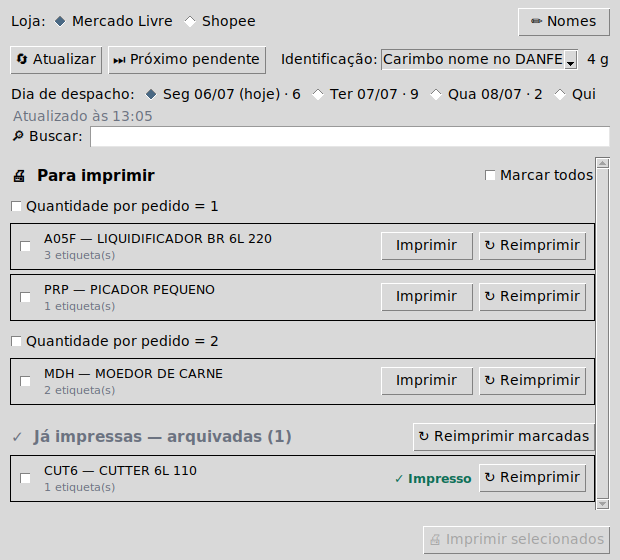

<div align="center">

# Contador — Separador de Etiquetas

**Separa e imprime etiquetas de envio do Mercado Livre e da Shopee em impressora térmica Zebra (ZPL), em lote e sem erro de separação.**

[](https://github.com/joaobz14/contador/actions/workflows/testes.yml)




</div>

---

## Visão geral

O **Contador** é uma ferramenta de mesa (Windows) para quem despacha muitos pedidos
por dia no **Mercado Livre** e na **Shopee**. Ele resolve a etapa de separação e
impressão: lê os pedidos prontos para envio, agrupa por **produto + quantidade**,
gera o **ZPL** e entrega um arquivo `.zip` na pasta **Downloads**, que um aplicativo
externo da Zebra reconhece e envia à impressora.

O ganho principal é a **separação por produto**: em vez de imprimir pedido a pedido,
o operador vê uma pilha de etiquetas por produto/quantidade, o que reduz erro e
retrabalho no empacotamento.

**Fluxo do sistema:**

```text
pedidos prontos → agrupamento (produto × qtd) → ZPL → .zip em Downloads → impressão na Zebra
```

---

## Principais recursos

### Marketplaces

- **Mercado Livre** e **Shopee** na mesma tela (a lógica de cada um fica atrás de
  uma abstração de provedor).
- **Multi-conta no Mercado Livre** (ex.: duas contas), cada uma com credenciais e
  estado isolados.
- **Modo "Ambas"** (Mercado Livre): junta as contas em um único dia de motorista,
  fundindo os grupos por SKU + quantidade — uma pilha por produto, num ZIP único.

### Impressão

- **Impressão em lote** (um único `.zip`, sem intervalo entre etiquetas).
- **Marcar todos** (geral e por bloco de quantidade).
- **Busca por nome ou SKU** na lista do dia.
- **Reimpressão** individual ou em lote (não altera o controle de "já impresso").
- **Confirmação física** antes de marcar como impresso: o app gera as etiquetas,
  pergunta se saíram corretamente e só então marca.
- **Carimbo na DANFE** com o **SKU** ou o **nome do produto** (o nome ganha a
  quantidade em destaque — `2x`, `3x` — em pedidos com 2 ou mais unidades).
- **Etiqueta divisória** ou **nenhuma identificação**, conforme a preferência.

### Operação

- **Nomes amigáveis** (SKU → nome) editáveis pela própria tela.
- **Atalhos de teclado**: `F5` (atualizar), `Ctrl+F` (buscar), `Esc` (limpar busca).
- **Dois PCs** com clones independentes, sincronizados por `git pull`.

### Shopee

- Organização do envio como **Postagem (drop-off)**, com confirmação.
- Espera automática do **rastreio (AWB)** emitido pela Shopee.
- Download da **etiqueta térmica** e exibição do rastreio na tela para conferência.

### Confiabilidade

- Estado de "já impresso" **por marketplace, conta e dia de despacho**.
- Gravação de arquivos **atômica e durável** (`.tmp` + `fsync` → `replace`).
- **Backup `.bak`** das credenciais, com auto-recuperação.
- **Credenciais fora do versionamento** (nunca vão para o Git).

### Automação

- **Bot do Telegram** opcional para consulta e — no Mercado Livre — impressão remota.

---

## Requisitos

| Requisito | Detalhe |
|---|---|
| Sistema | **Windows** |
| Python | **3.11 ou superior** |
| Git | Para clonar e atualizar o projeto |
| Impressora | **Zebra** compatível com **ZPL** |
| Dependências | Listadas em `requirements.txt` |
| Mercado Livre | Aplicação criada no DevCenter (App ID e Client Secret) |
| Shopee | App **Live** em [open.shopee.com](https://open.shopee.com) |
| Redirect URL (Shopee) | `https://joaobz14.github.io/contador/` |
| App da Zebra | `impressora_zebra_usb.py` — **externo a este repositório**; monitora a pasta Downloads e envia os `.zip` à impressora |

---

## Instalação rápida

```bash
git clone https://github.com/joaobz14/contador.git
cd contador
python -m venv .venv
.venv\Scripts\activate
pip install -r requirements.txt
```

---

## Configuração

### Mercado Livre (uma vez por conta)

```bash
python pegar_token.py
```

O programa pede o **nome da conta** e salva as credenciais em
`contas/{nome}/credenciais.json`. **Repita para cada conta** que você usa.

> Atalho no Windows: `atalhos\Pegar Token.bat`.

### Shopee (uma vez)

```bash
python pegar_token_shopee.py
```

**Pré-requisito:** o app da Shopee precisa estar **Live** em
[open.shopee.com](https://open.shopee.com), com a Redirect URL
`https://joaobz14.github.io/contador/` cadastrada (essa página é servida pela
pasta `docs/` via GitHub Pages).

> Atalho no Windows: `atalhos\Pegar Token Shopee.bat`.

### Credenciais

- As credenciais **nunca são versionadas** — já constam no `.gitignore`.
- **Modelos** dos arquivos de configuração ficam em [`exemplos/`](exemplos/).
- Detalhes na seção [Segurança e credenciais](#segurança-e-credenciais).

---

## Uso diário

1. Abra a tela com **`Abrir Separador.bat`** (duplo-clique, sem janela de terminal).
   - Se a tela não abrir, use **`atalhos\Abrir Separador (diagnostico).bat`**, que
     mantém o terminal aberto mostrando o erro.
2. Escolha a **loja**, a **conta** (no Mercado Livre) e o **dia de despacho**.
3. Clique em **Atualizar** — cada dia do seletor mostra quantos pedidos tem.
4. **Marque os grupos** (ou use *Marcar todos*).
5. Clique em **Imprimir selecionados** — todas as etiquetas saem num único `.zip`.
6. **Confirme fisicamente**: quando o app perguntar se as etiquetas saíram
   corretamente, responda apenas depois de conferir a impressão. Só então os grupos
   são marcados como impressos.

> **Shopee:** antes de imprimir, o app pergunta se pode **organizar o envio**
> (Postagem/drop-off). Esse passo é o que gera o rastreio (AWB) e, portanto, a
> etiqueta. Só depois dele a etiqueta existe.

---

## Dois PCs (escritório e casa)

- Cada PC usa o **seu próprio clone** do repositório.
- Para atualizar, use **`Atualizar programa.bat`** (executa `git pull`) em cada máquina.
- Os **nomes amigáveis** (`nomes_sku.json`) viajam pelo Git entre os PCs.
- As **credenciais** e o **estado de impresso** permanecem **locais** de cada máquina.

---

## Bot do Telegram (opcional)

Permite consultar os pedidos pelo celular e, no **Mercado Livre**, disparar a
impressão remotamente.

```bash
pip install -r requirements-bot.txt
copy exemplos\bot_config.example.json bot_config.json
python bot_telegram.py
```

Preencha o `bot_config.json` com o **token** do bot (obtido no `@BotFather`).

**Comandos:**

| Comando | Função |
|---|---|
| `/hoje` `/amanha` `/dia <AAAA-MM-DD>` `/todos` | Lista os grupos por dia de despacho |
| `/resumo` | Quantidade de pacotes por dia |
| `/detalhar <SKU>` | Composição de um SKU |
| `/conta` | Vê/troca a conta ativa (com 2+ contas) |
| `/loja` | Alterna entre Mercado Livre e Shopee |
| `/id` | Mostra o seu chat id |
| `/menu` | Abre o menu de botões |

**Regras e detalhes:**

- **Impressão pelo bot é apenas Mercado Livre.** Na Shopee, o bot é **somente
  consulta** — a impressão da Shopee é feita no aplicativo de mesa.
- A impressão sai **na máquina onde o bot está rodando** (o `.zip` cai no Downloads
  dela). Rode o bot no PC do escritório, com a Zebra ligada.
- **Segurança:** o bot só responde aos `chat_ids` autorizados; o token vem do
  `bot_config.json` (não versionado) ou da variável `TELEGRAM_BOT_TOKEN`. Envie
  `/id` ao bot para descobrir o seu chat id.
- **Aviso da manhã:** defina `"aviso_horario": "08:00"` no `bot_config.json` para
  receber o resumo do dia nesse horário (fuso de Brasília).
- **Iniciar o bot:** `atalhos\Iniciar Bot.bat` (simples) ou
  `atalhos\Iniciar Bot (auto).bat` (reinicia sozinho se cair — recomendado).
- A atividade e os erros ficam registrados em `bot.log`.

---

## Linha de comando

Alternativa à interface gráfica, útil para diagnóstico e automação.

### Mercado Livre

```bash
python separador_etiquetas_ml.py                          # grupos prontos de HOJE
python separador_etiquetas_ml.py todos                    # todos os dias
python separador_etiquetas_ml.py envios                   # datas de despacho de cada envio
python separador_etiquetas_ml.py resumo                   # pacotes por dia
python separador_etiquetas_ml.py detalhar "<nome>" <QTD>  # composição de um grupo
python separador_etiquetas_ml.py imprimir "<nome>" <QTD>    # imprime um grupo
python separador_etiquetas_ml.py reimprimir "<nome>" <QTD>  # reimprime (não altera o estado)
python separador_etiquetas_ml.py proximo                   # imprime o próximo pendente
python separador_etiquetas_ml.py rastrear <SKU>           # diagnóstico de um SKU
```

### Shopee

```bash
python shopee_api.py                                      # grupos prontos de HOJE
python shopee_api.py amanha                               # grupos de amanhã
python shopee_api.py todos                                # todos os dias da janela
python shopee_api.py dia <AAAA-MM-DD>                     # um dia específico
python shopee_api.py etiqueta <order_sn>                  # gera/baixa a etiqueta (Downloads)
python shopee_api.py parametros <order_sn>                # diagnóstico dos tipos de documento
```

> Atalho no Windows para a Shopee: `atalhos\Etiqueta Shopee.bat` lista os pedidos de
> hoje, pergunta o `<order_sn>` e gera a etiqueta.

---

## Funcionamento interno

### Agrupamento

A identidade de cada produto é definida nesta ordem de prioridade:
**SKU → GTIN + voltagem → `item_id:variação`**. O agrupamento é **por envio = 1
etiqueta**: um pedido com vários SKUs diferentes (kit/combo) vira um único grupo
"Combo", listando os itens, em vez de ser separado por SKU.

### Identificação na impressão

O seletor da tela oferece quatro modos, aplicados **apenas na DANFE** (a etiqueta de
envio permanece intacta):

| Modo | O que é impresso na DANFE |
|---|---|
| **Carimbo SKU** | O código do produto, centralizado na área livre |
| **Carimbo nome** | O nome cadastrado (fonte adaptativa: nomes curtos maiores, longos em até 3 linhas; sem nome cadastrado, cai no SKU). Pedidos com 2+ unidades ganham a quantidade em destaque (`2x`, `3x`…) |
| **Etiqueta divisória** | Uma página separadora antes de cada lote |
| **Nenhuma** | Sem identificação |

### Fluxo Shopee

A etiqueta só existe **após organizar o envio**, que é o passo que emite o AWB:

1. Listar pedidos prontos e agrupar por SKU + quantidade.
2. **Organizar o envio** como Postagem (drop-off) → a Shopee emite o **AWB
   (tracking_number)**.
3. **Criar o documento térmico**, que **exige o AWB** no corpo da requisição.
4. Aguardar o status **`READY`** e **baixar** a etiqueta.
5. Salvar o `.zip` na pasta Downloads (contém o ZPL que a Zebra imprime direto).

### Nomes amigáveis

O arquivo `nomes_sku.json` (versionado) mapeia `SKU → nome`. Ele é editável pela
própria tela (busca, salvar, remover), sem risco de corromper o JSON. É apenas
exibição: o agrupamento e o controle de impresso continuam pelo SKU.

### Estado de "já impresso"

Registrado **por marketplace, conta e dia de despacho** — no Mercado Livre em
`contas/{conta}/estado_grupos.json`, na Shopee em `estado_shopee.json`. Lotes só são
marcados **após a confirmação física** do operador. Reimpressão **não altera** esse
estado.

### Arquivos gerados (não versionados)

`credenciais.json` e os backups `.bak`, `credenciais_shopee.json`,
`estado_grupos.json`, `estado_shopee.json`, `itens_cache.json`, `envios_cache.json`,
`config.json`, `bot_config.json`, `bot.log`, `shopee_tempos.log` e
`link_autorizacao*.txt`.

---

## Segurança e credenciais

- **Nunca são commitados:** credenciais do Mercado Livre e da Shopee, tokens,
  configuração do bot, arquivos de estado e caches. Todos constam no `.gitignore`.
- **São locais de cada máquina:** credenciais, estado de impresso, caches, `config.json`,
  `bot_config.json` e logs.
- **Modelos em [`exemplos/`](exemplos/):** copie os arquivos `*.example.json` e
  preencha com os seus dados — assim você não precisa versionar nada sensível.
- **Token do bot** vem do `bot_config.json` ou da variável `TELEGRAM_BOT_TOKEN`,
  nunca do código.
- **Backups `.bak`:** cada arquivo de credenciais tem um espelho `.bak` com
  auto-recuperação — uma queda de energia durante a gravação não obriga a refazer o
  token. Os `.bak` também não são versionados.

---

## Testes

```bash
pip install -r requirements-dev.txt
pytest
```

A suíte roda **sem rede** e sem arquivos reais.

Para inspecionar a interface **sem monitor** (headless), em máquinas sem display:

```bash
bash tools/setup_gui_tests.sh                             # 1x: tkinter + xvfb + imagemagick
xvfb-run -a python3.12 tools/gui_screenshot.py out.png    # modo Mercado Livre
xvfb-run -a python3.12 tools/gui_screenshot.py shopee.png Shopee
```

O CI (`.github/workflows/testes.yml`) roda o `pytest` (Python 3.11 e 3.12) e o job
**`gui-smoke`**, que abre a tela headless nos dois marketplaces e publica os
screenshots como artefato de cada execução.

---

## Estrutura do projeto

| Caminho | Função |
|---|---|
| `separador_etiquetas_ml.py` | Núcleo: API do Mercado Livre, agrupamento, ZPL, carimbo e CLI |
| `estado.py` | Camada comum do estado "já impresso" (ML + Shopee) e IO de JSON atômico |
| `shopee_api.py` | Integração Shopee (API v2): listar, organizar envio, etiqueta e estado |
| `provedores.py` | Abstração de marketplace usada pela interface (ML, Shopee e modo Ambas) |
| `separador_gui.py` | Interface gráfica (Tkinter) |
| `bot_telegram.py` / `relatorio.py` | Bot do Telegram e formatação dos textos |
| `pegar_token.py` / `pegar_token_shopee.py` | Configuração inicial (OAuth) do ML e da Shopee |
| `Abrir Separador.bat` | Atalho principal para abrir a tela |
| `Atualizar programa.bat` | Atualiza o projeto (`git pull`) |
| `atalhos/` | Demais atalhos do Windows (tokens, bot, diagnóstico, etiqueta Shopee) |
| `exemplos/` | Modelos dos arquivos de configuração |
| `tests/` | Testes automatizados (pytest) |
| `tools/` | Ferramentas de desenvolvimento (screenshot headless da GUI) |
| `docs/` | Página de callback da Shopee, imagens e notas de arquitetura |

---

## Limitações conhecidas

- **Impressão pelo bot é apenas Mercado Livre.** Na Shopee, o bot é somente consulta;
  a impressão da Shopee é feita pelo aplicativo de mesa.
- **O aplicativo da Zebra (`impressora_zebra_usb.py`) é externo** a este repositório —
  ele monitora a pasta Downloads e é quem envia os `.zip` à impressora.
- **Foco em Windows + Zebra (ZPL).** O projeto não tem suporte a outras plataformas
  ou impressoras.

---

## Licença / status

Nenhuma licença pública está definida para este repositório até o momento. Sem uma
licença, todos os direitos são reservados por padrão. Caso pretenda abrir o código,
considere adicionar um arquivo `LICENSE` (por exemplo, MIT).
